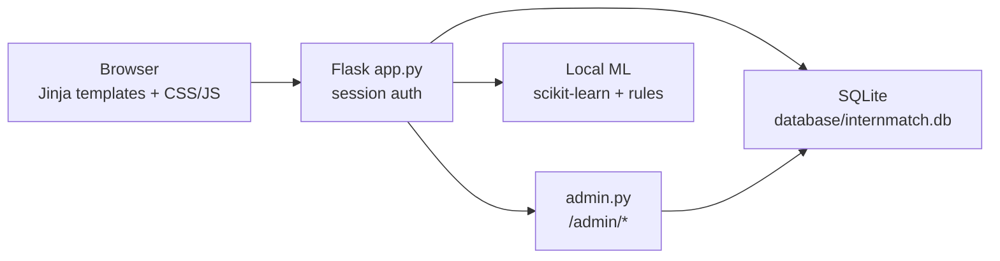

# InternMatch AI — Architecture

InternMatch AI is a **local Flask web app for interview and internship preparation**. It is not a job board and does not send applications to companies.

Students upload a resume, see role readiness and skill gaps, practice exams and interviews, and track progress. Scores are **practice estimates**, not hiring decisions.

**Live site:** https://internmatch.pythonanywhere.com  
**Source:** https://github.com/Soumilidas1234/internmatch

---

## 1. What the system does

| Students can | Students cannot |
| --- | --- |
| Analyze a resume (skills extracted from the file) | Browse or apply to real internships |
| Check role readiness and skill gaps | Call ChatGPT or any cloud AI API |
| Run ATS-style keyword checks and JD analysis | Get a guaranteed job or internship |
| Practice AI examiner, mock interview, viva, question banks | Store camera/mic audio on the server |
| Rebuild a target-role resume PDF | |

Internship listing/apply URLs still exist for compatibility; they **redirect** into preparation flows. The `internships` / `applications` tables are leftover from an earlier matching prototype.

---

## 2. High-level shape



Everything runs in **one Python process**. There is no separate API service, Redis, or message queue.

---

## 3. Layers

```
Browser
  templates/          Jinja pages
  static/css          style.css + visual.css (product look)
  static/js           visual.js, video_interview.js
  static/images       3D-style illustrations
        │
Flask (app.py)
  Routes, login_required, file upload (max 2 MB)
  Blueprint admin_bp → /admin
        │
Domain helpers
  tools.py            resume text, known skills, examiner, mock-interview questions
  ml/                 matching, prep, ATS, JD, resume interview, role questions
        │
Persistence
  models/             SQLAlchemy models
  config.py           .env → SECRET_KEY, DB URI, admin/demo passwords
  database/internmatch.db
```

| Path | Role |
| --- | --- |
| `app.py` | Student routes, dashboard, exams, interviews |
| `admin.py` | Admin login, students, analytics (not internship CRUD for students) |
| `config.py` | Environment settings; fails startup if `SECRET_KEY` is missing |
| `models/` | `User`, `ExamAttempt`, `JobAnalysis`, `AtsSimulation`, `ResumeInterviewSession`, `RoleQuestionSet`, `SavedRoleQuestion`, plus unused internship/application models |
| `ml/matcher.py` | TF-IDF + cosine similarity + skill overlap for **student ↔ target role** |
| `ml/neural_matcher.py` | Small local scikit-learn MLP score (not an LLM) |
| `ml/prep.py` | Readiness blend, skill gap, 14-day plan, mistake review |
| `ml/resume_fixer.py` | Rebuild resume PDF with ReportLab |
| `ml/ats_simulator.py` | Educational keyword / structure score |
| `ml/jd_analyzer.py` | Job description vs resume skills |
| `ml/resume_interview.py` | Questions grounded in resume claims |
| `ml/role_questions.py` | Role or JD question banks + practice scoring |
| `ml/roles.py` | Target-role skill specs |
| `tools.py` | PDF/text extract, `KNOWN_SKILLS`, examiner, video-interview Q&A |
| `seed.py` | Demo student + admin user on startup |
| `pythonanywhere_wsgi.py` | Production WSGI entry (`application`) |

---

## 4. Request flow (typical student session)

1. Browser hits Flask (`/` public; most tools need login).
2. `login_required` checks `session["user_id"]`.
3. Route loads the `User` row, optional resume text from `last_resume_text` / session.
4. A **local** function scores or generates content (no outbound AI HTTP).
5. Some results are saved (exam attempts, ATS, JD analysis, question sets).
6. Jinja renders a page that extends the shared navbar (`templates/partials/navbar.html`).

**Dashboard** is the hub: greeting, target role, readiness %, strengths/gaps, and a next step from existing data (resume skills, last exam, missing skills).

---

## 5. Matching and “AI”

There are **no cloud models**. “AI” means local heuristics + scikit-learn.

**Role readiness** (same engine as the old internship matcher):

1. Parse skills from the student profile / resume.
2. Compare to the target role’s required skills → overlap % + missing list.
3. TF-IDF vectors of student text vs role text → cosine similarity.
4. Optional local MLP score from `neural_matcher.py`.
5. `ml/prep.py` blends these into one **interview readiness** percentage and human labels.

**Resume analysis:** extract text (pypdf), scan against `KNOWN_SKILLS` in `tools.py`. Skills that are not in the document are not invented.

**AI examiner:** role-specific questions, keyword-style scoring, topic scores and mistakes stored in `exam_attempts`.

**Mock interview (`/video-interview`):** questions scored in Flask (`/api/video-interview/score`). Camera and microphone stay **in the browser** (`getUserMedia`, Speech Recognition, speechSynthesis). Nothing is uploaded.

---

## 6. Data

**Engine:** SQLite via Flask-SQLAlchemy. Default file: `database/internmatch.db`.

**Auth:** Werkzeug password hashes. Student session cookie. Admin is a `User` with `is_admin` and a separate `/admin/login`.

**Important student fields:** `skills`, `target_role`, `last_resume_text`, `resume_analyzed_count`.

**Practice history:** exam attempts, job analyses, ATS simulations, resume-interview sessions, role question sets / saved questions.

Do **not** replace the live `.db` on PythonAnywhere when deploying. Git updates code only.

---

## 7. Frontend

- Server-rendered Jinja (not a SPA).
- `static/css/style.css` — layout
- `static/css/visual.css` — light product UI (navy hero, white cards, blue buttons)
- Navbar groups: Dashboard, My Profile, Preparation, Practice, Progress
- 3D-style PNGs in `static/images/` used as decoration on selected pages
- No Three.js; no cloud front-end APIs

---

## 8. Auth and roles

```
Visitor → /login or /register
Student → /dashboard and prep/practice tools
Admin   → /admin/login → student list / analytics
```

Demo examiner account (from `.env`): `demo.student@internmatch.local`.  
Admin email defaults to `admin@internmatch.local`; password is `ADMIN_PASSWORD` (never committed).

---

## 9. Deployment

| Environment | How it runs |
| --- | --- |
| Laptop | `.\venv\Scripts\python.exe app.py` → http://127.0.0.1:5000/ |
| Production | PythonAnywhere WSGI loads `pythonanywhere_wsgi.py` → `app` as `application` |

Update live code with `git pull origin main`, then **Web → Reload**. Prefer pull over `reset --hard` unless history was rewritten.

`.env` holds `SECRET_KEY`, `ADMIN_PASSWORD`, `DEMO_STUDENT_PASSWORD`, `FLASK_ENV=production`. It is not in git.

---

## 10. Tests

`tests/` uses pytest against Flask routes and ML helpers (`test_routes.py`, matcher, ATS, JD, resume interview, role questions, resume fixer). Run from the project venv.

---

## 11. Design constraints (do not break)

- Local ML only — no OpenAI / Gemini / Hugging Face APIs
- Do not invent resume skills or work history
- Do not process real internship applications
- Keep student data in SQLite; never commit `.env` or `*.db`
- Practice scores must stay labeled as estimates
